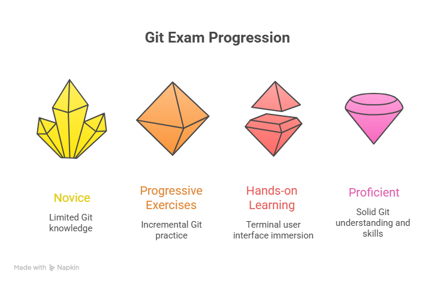
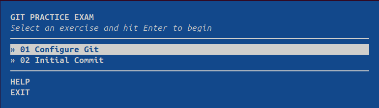

# Git Test
  

**Git Test** is a minimal **terminal-based (TUI) exam** designed to test and improve your **Git knowledge**.  
It is built using the **`workshopper-adventure`** library from the **NodeSchool ecosystem**, allowing users to progress through exercises step-by-step in the terminal.

Each task must be completed successfully to unlock the next one, creating a guided learning and testing experience directly in the command line.

  

---

## Overview

Git Test is currently a **local project** intended to experiment with a structured Git learning workflow.  
The long-term goal is to ship it as an **npm package** once the project becomes mature enough.

The project aims to:

- Cover **as many Git concepts as possible**
- Provide **progressive exercises**
- Support **personal progress tracking**
- Offer a **terminal-based interactive experience**

---

## Project Structure


The `exercises` folder contains:

- The list of exercises
- Their **verification models**
- Implementations using the **`workshopper-adventure`** framework

Each exercise validates the user's solution before allowing them to continue to the next challenge.

---

## Installation & Usage

For now, the project includes two basic exercices and they are run locally.

### 1. Clone the repository
### 2. Install dependencies
```bash
npm install
```

### 3. Link the package globally
```bash
npm link
```

### 4. Start the exam
```bash
git-test
```

**This will display the list of available exams in the terminal interface.**

---

## Goals

The project aims to be transversal, touching a wide range of Git concepts such as:

  - Repository initialization
  - Staging and commits
  - Branching
  - Merging
  - ...
  
---

## Contributing

Ideas, suggestions, and contributions are welcome.
If you have ideas for:

  - New Git exercises
  - Better verification models
  - Improved learning flow
  - Additional Git concepts to cover

Feel free to contribute.

---
## License

	This project is licensed under the MIT License.
  

